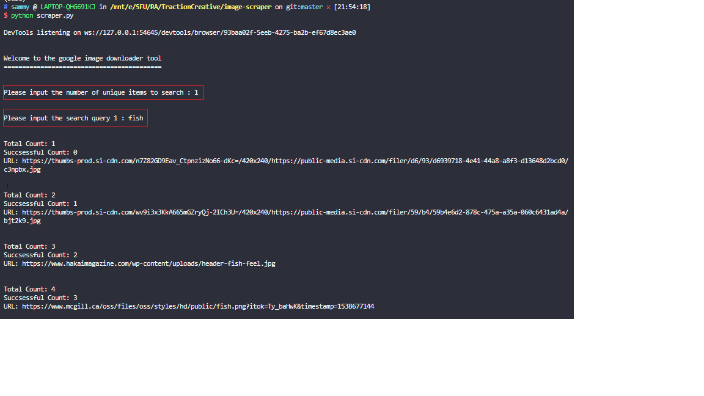

# :wrench: Image Scraper :wrench:

#### This tool can be used to scrape google image for any given input query. It can take multiple queries and neatly store them in respective folders.


### Prerequisites

install **Python Selenium package**

```bash
pip install selenium
```

uncomment code for **chromedriver** based on the OS

```bash
#chrome driver path based on platform

DRIVER_PATH_WIN = "./chrome-driver/chromedriver-win.exe"
#DRIVER_PATH_LINUX = "./chrome-driver/chromedriver-linux"
#DRIVER_PATH_MAC = "./chrome-driver/chromedriver-mac"
```

### Usage


